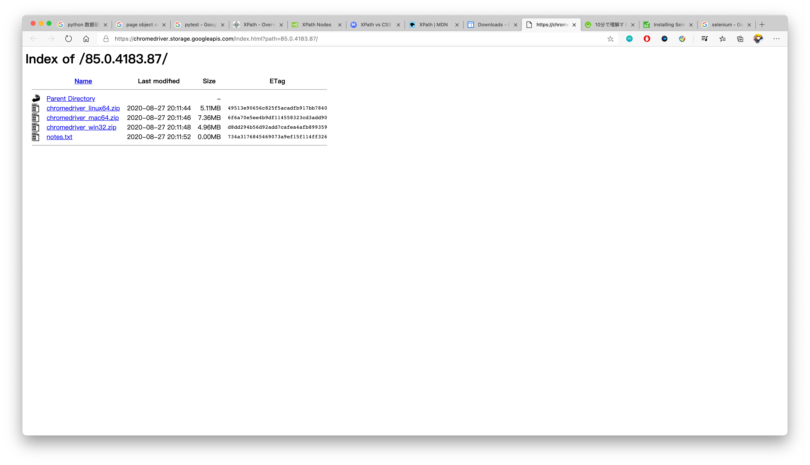
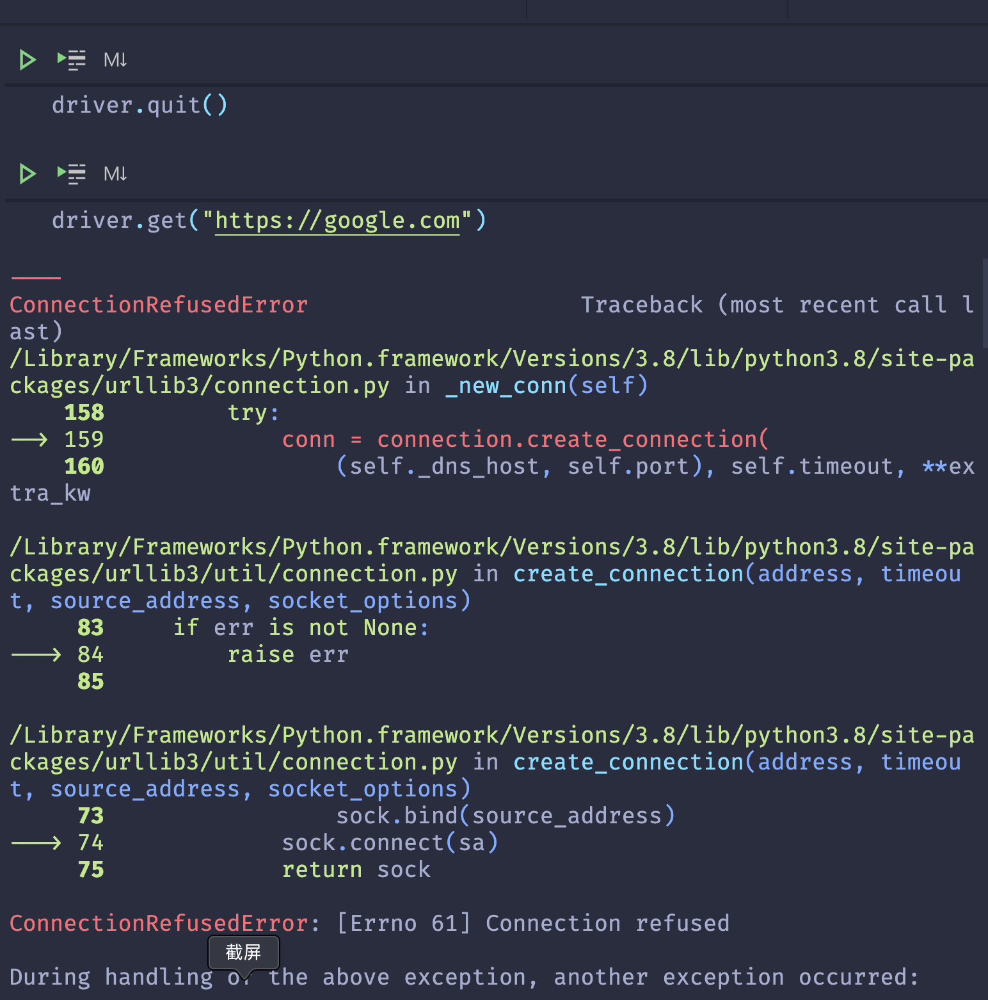

# Seleniumの基本

## 1. Seleniumに関する簡単な紹介

[SeleniumのWiki](https://ja.wikipedia.org/wiki/Selenium_(%E3%82%BD%E3%83%95%E3%83%88%E3%82%A6%E3%82%A7%E3%82%A2))

> Selenium は、 Webアプリケーションをテストするための**ポータブルフレームワーク**である。  
> 元々は Web アプリケーションの UI テストや JavaScript のテストの目的で開発されましたが、テスト以外にもタスクの自動化や Web サイトのクローリングなど様々な用途で利用されています。

[Selenium Home Page](https://www.selenium.dev/)


HPから一目瞭然、Selenium はいくつかのコンポーネントで構成され、それぞれがWeb アプリケーションのテスト自動化の開発を支援する特定の役割を果たす。

* WebDriver: Selenium RC の後継である。コマンドを受け入れ、それらをブラウザ(Firefox、Google Chrome、Internet Explorer、Safari、Microsoft Edge 等)に送信する。Selenium-Webdriver(Selenium 2.0)から**Python**、Ruby、Java、およびC＃で完全に実装およびサポートされている。
* IDE: テスト用の*統合開発環境*である。これは、**Firefox**アドオンおよび**Chrome**拡張機能として実装される。機能テストの**記録**、編集、デバッグが可能である。
* Grid: リモートマシンで実行されているWeb ブラウザインスタンスをテストで使用できるようにするサーバである。


Excelのマクロ記録とVBAの違いみたいに、簡単なケースならIDEで記録して再現すればいいんだが、本番はやはりWebDriver〜  
IDEの使い方に興味があるなら、ここを参考してください。＝＞[click me](https://qiita.com/jun2014/items/bf6b87699b7622c91326)  
本記事はWebDriverをメインとする。

## 2. インストール

ステップ１：　selenium　librariesをインストール

```python
pip install selenium  # 安定版
pip install selenium==4.0.0a6.post1  # alpha版
```

※他の言語もできる。

Python以外に、Java, C#, Ruby, JavaScriptなども公式的に支持されている。  
Pythonが一番簡単なので、ここでPythonを使う。

ステップ２：　Driversをダウンロード

| Browsers |                                 Address                                 |
| :------: | :---------------------------------------------------------------------: |
|  Chrome  |    `https://sites.google.com/a/chromium.org/chromedriver/downloads`     |
| Firefox  |            `https://github.com/mozilla/geckodriver/releases`            |
|   Edge   | `https://developer.microsoft.com/en-us/microsoft-edge/tools/webdriver/` |
|  Safari  |                           Safari 10+ いらない                           |

Chromeは一番使われているので、Chromeを例としてダウンロードする。


ここは、自分が使っているChromeのバージョンを確認する必要がある。


自分の場合、Chrome85を使っているため、該当のリンクをクリックする。


基本OSの種類によってクリックする。
win32のzipファイルを解凍すると、`chromedriver.exe`のファイルが出て来る。


※便利のため、ダウンロードされた`chromedriver.exe`をPythonの**Script**folderに置くのがお勧め。


## 3. 動かしてみる

```python
from selenium import webdriver
from selenium.webdriver.common.keys import Keys

driver = webdriver.Chrome()

driver.get("https://www.google.com")

search_element = driver.find_element_by_name("q")
search_element.send_keys("天気予報")
search_element.send_keys(Keys.ENTER)

rainfall_probability_element = driver.find_element_by_id("wob_pp")
print(f"現在の降水確率は{rainfall_probability_element.get_property('innerHTML')}")

driver.quit()
```

`chromedriver.exe`をScriptフォルダーに置いていない場合は、下記のように`executable_path`を設置する必要がある。

```python
path = r"\path\to\chromedriver"
driver = webdriver.Chrome(executable_path=path)
```

一行ずつ説明する。

* `from selenium import webdriver`:

* `from selenium.webdriver.common.keys import Keys`: `Enter`, `Esc`などの特殊なキーを入力するためのモジュール
* `driver = webdriver.Chrome()`: ブラーウザの種類によってインスタンス化する。
.png)
様々なブラウザを支持している。

`chrome_options`などパラメータの設定は可能である。
* `driver.get("https://www.google.com")`: 指定するURLにアクセスする。`https://`の部分が必要不可欠。
* `search_element = driver.find_element_by_name("q")`:

`F12`キーを押して、searchbarの要素をチェックしたら、`name="q"`を確認できる。そこで、`find_element_by_name`でelementを取得する。
* `search_element.send_keys("天気予報")`: searchbarに文字列を入力する。
* `search_element.send_keys(Keys.ENTER)`: `Enter`を入力する。
* `rainfall_probability_element = driver.find_element_by_id("wob_pp")`:

* `print(f"現在の降水確率は{rainfall_probability_element.get_property('innerHTML')}")`: `span`elementの`innerHTML`プロパティーで中身を取得する。
* `driver.quit()`: ブラウザを閉じる。

## 4. elementの取得

### 一つの場合

* find_element_by_class_name
* find_element_by_id
* find_element_by_name
* find_element_by_tag_name
* find_element_by_link_text
* find_element_by_partial_link_text
* find_element_by_xpath
* find_element_by_css_selector

### 複数の場合

* find_elements_by_class_name
* find_elements_by_tag_name
* find_elements_by_name
* find_elements_by_link_text
* find_elements_by_partial_link_text
* find_elements_by_xpath
* find_elements_by_css_selector

※違う点：

1. `element`と`elements`
2. 複数の場合、**id**のメソッドがない（idは唯一だから）
3. 複数の場合の戻り値はlist、見つからない場合は空のlist`[]`
4. 一つの場合`WebElement`、見つからない場合`NoSuchElementException`を投げる


もう気付いたと思うが、これらのメソッドはJavaScriptでDOMを操作する方法と似ている。

|            JavaScript             |         Selenium(Python)          |
| :-------------------------------: | :-------------------------------: |
|     `document.getElementById`     |       `find_element_by_id`        |
|   `document.getElementsByName`    |      `find_elements_by_name`      |
| `document.getElementsByClassName` |   `find_elements_by_class_name`   |
|  `document.getElementsByTagName`  |    `find_elements_by_tag_name`    |
|   `document.querySelector(All)`   | `find_element(s)_by_css_selector` |
|        `document.evaluate`        |     `find_elements_by_xpath`      |

`find_element(s)_by_link_text`と`find_element(s)_by_partial_link_text`は該当のものがないらしい。
この二つは`<a></a>`に対するメソッドである。`by_link_text`は完全マッチ、`by_partial_link_text`は部分マッチ。

`css selector`と`XPath`強いツールなので、基本的にこの二つの方法で取得する。

## 5. CSS Selector

[MDN](https://developer.mozilla.org/ja/docs/Learn/CSS/Building_blocks/Selectors)

### 基本セレクター

|      セレクター      |      タイプ      |
| :------------------: | :--------------: |
|          *           |  全称セレクター  |
|          E           |  要素セレクター  |
|         #ID          |   IDセレクター   |
|        .class        | クラスセレクター |
| selector1, selectorN |  複数セレクター  |

### 結合子セレクター

| セレクター |     タイプ     |
| :--------: | :------------: |
|    E F     |   子孫結合子   |
|    E>F     |    子結合子    |
|    E+F     | 隣接兄弟結合子 |
|    E~F     | 一般兄弟結合子 |

### [擬似クラスセレクター](https://developer.mozilla.org/ja/docs/Web/CSS/Pseudo-classes)

### 動的

| セレクター |                  機能                   |
| :--------: | :-------------------------------------: |
|   E:link   |          まだ訪問されていない           |
| E:visited  |               訪問された                |
|  E:hover   | マウスポインタ―が要素の上を通過するとき |
|  E:active  |              アクティブ化               |
|  E:focus   |            フォーカスを持つ             |

> “LVHA順” LoVe/HAte
> Link-visited-hover-active

#### ターゲット

| セレクター |                               機能                                |
| :--------: | :---------------------------------------------------------------: |
|  E:target  | URLのフラグメントに一致する id を持つ固有の要素 (対象要素) を表す |

#### 言語

:lang E(language)は要素を定義された言語に基づいて選択します

#### UI要素の状態

| セレクター |       タイプ       |
| :--------: | :----------------: |
| E:checked  | チェックされている |
| E:enabled  |        有効        |
| E:disabled |        無効        |

#### 仕組み

* E:first-child
* E:last-child
* E:root
* E F:nth-child(n)
* E F:nth-last-child(n)
* E:nth-of-type(n)
* E:nth-last-of-type(n)
* E:first-of-type
* E:last-of-type
* E:only-child
* E:empty

> nは整数,キーワード(even,odd),計算式(2n+1)等使える  
> nは１から、０の場合何も選択しない  
> `:empty`は要素のノードまたは文字列 (ホワイトスペースを含む)を持たない要素を表す

#### 否定

| セレクター |     機能     |
| :--------: | :----------: |
|  E:not(F)  | F以外のE要素 |

### 疑似要素セレクター

> CSS3は疑似要素セレクターと擬似クラスセレクターを区別するためにそれぞれ`::`と`:`を使うのをすすめ。

* ::first-letter
* ::first-line
* ::before
* ::after
* ::selection

### [属性セレクター](https://developer.mozilla.org/ja/docs/Web/CSS/Attribute_selectors)

|  セレクター   |                                             機能                                              |
| :-----------: | :-------------------------------------------------------------------------------------------: |
|    E[attr]    |                                attrという名前の属性を持つ要素                                 |
|  E[attr=val]  |              attr という名前の属性の値が正確に(case sensitive) value である要素               |
| E[attr\|=val] | attr という名前の属性の値が正確に value と一致するか、 value で始まり直後にハイフンが続く要素 |
| E[attr~=val]  |                       空白区切りの属性のリストの中にattrが存在する要素                        |
| E[attr*=val]  |                attr という名前の属性の値が、文字列中に value を1つ以上含む要素                |
| E[attr^=val]  |                        attr という名前の属性の値が value で始まる要素                         |
| E[attr$=val]  |                        attr という名前の属性の値が value で終わる要素                         |

> Eが省略される时は任意タイプの要素を表す

## 6. [XPath](https://developer.mozilla.org/ja/docs/Web/XPath)

### [紹介](https://www.w3schools.com/xml/xpath_intro.asp)


XPathは`XML Path Language`の略称  
ご存知の通り、CSSはHTMLをどうのように表示するかを記録する。一方、XMLの場合は、`div`など事前に定義されたタッグはない。そこで、XSL(Extensible Stylesheet Language)が登場された。XPathはXSLの一部で、要素のナビの役割を担当している。

### [Syntax](https://www.w3schools.com/xml/xpath_syntax.asp)

```xml
<?xml version="1.0" encoding="UTF-8"?>

<bookstore>

<book>
  <title lang="en">Harry Potter</title>
  <price>29.99</price>
</book>

<book>
  <title lang="en">Learning XML</title>
  <price>39.95</price>
</book>

</bookstore>
```

#### Nodesを選択

| expression |                             description                             |
| :--------: | :-----------------------------------------------------------------: |
| node-name  |         Select all nodes with the given **name** "nodename"         |
|     /      |               Selection starts from the **root** node               |
|     //     | Selection starts from the **current** node that match the selection |
|     .      |                    Selects the **current** node                     |
|     ..     |             Selects the **parent** of the current node              |
|     @      |                       Selects **attributes**                        |

上のようなXMLファイルを例とする。

| Path Expression |                    結果                    |
| :-------------: | :----------------------------------------: |
|    bookstore    |     全ての"bookstore"のNodesを選択する     |
|   /bookstore    |        root要素bookstoreを選択する         |
| bookstore/book  |   bookstoreの全てのbook子要素を選択する    |
|     //book      |    documentの中のbook要素を全部選択する    |
| bookstore//book |   bookstoreの子孫book要素を全部選択する    |
|     //@lang     | `lang`の属性を持っている要素を全部選択する |

#### 特定な要素

|       Path Expression        |                                結果                                |
| :--------------------------: | :----------------------------------------------------------------: |
|      /bookstore/book[1]      |       bookstoreの子要素の中の最初のbook要素を選択※**１base**       |
|   /bookstore/book[last()]    |            bookstoreの子要素の中の最後のbook要素を選択             |
| bookstore/book[position()<3] |        bookstoreの子要素の中の最初の*二つ*のbook要素を選択         |
|        //title[@lang]        |         `lang`の属性を持っている全てのtitle要素を選択する          |
|   bookstore/book[price>35]   | bookstoreの子book要素の中に、priceの属性が３５以上の要素の選択する |

#### Wildcard

| Wildcard |     Description      |
| :------: | :------------------: |
|    \*    |  任意なelement node  |
|   @\*    | 任意なattribute node |
|  node()  |      任意なnode      |

#### 複数を選択

`|`を利用する

### [Axes](https://developer.mozilla.org/ja/docs/Web/XPath/Axes)

|      AxisName      |                                               Result                                                |
| :----------------: | :-------------------------------------------------------------------------------------------------: |
|      ancestor      |                    コンテクストノードの親ノードからルートノードまでの全ての祖先                     |
|  ancestor-or-self  |                       コンテクストノードと、その全てのルートノードを含む祖先                        |
|     attribute      |                                      コンテクストノードの属性                                       |
|       child        |                                       コンテクストノードの子                                        |
|     descendant     |                  コンテクストノードの全ての子と、その全ての子と、そのまた全ての･･･                  |
| descendant-or-self |                                コンテクストノードと、その全ての子孫                                 |
|     following      |      コンテクストノードの後に現れる、descendant、attribute、namespace ノードを除く全てのノード      |
| following-sibling  |     コンテクストノードと同じ親を持ち、ソース文書内でコンテクストノードの後に現れる全てのノード      |
|     namespace      |                          コンテクストノードのスコープ内にある全てのノード                           |
|       parent       |                              コンテクストノードの親である単一のノード                               |
|     preceding      | 文書内でコンテクストノードの前に現れる、 ancestor、 attribute 、 namespace ノードを除く全てのノード |
| preceding-sibling  |     コンテクストノードと同じ親を持ち、ソース文書内でコンテクストノードの前に現れる全てのノード      |
|        self        |                                       コンテクストノード自身                                        |

### [operator](https://www.w3schools.com/xml/xpath_operators.asp)

| Operator |     Description      |
| :------: | :------------------: |
|    \|    | 二つのnodesetのunion |
|    +     |        足し算        |
|    -     |        引き算        |
|    \*    |        掛け算        |
|   div    |        割り算        |
|    =     |        equal         |
|    !=    |      not equal       |
|    <     |      less than       |
|    <=    |         以下         |
|    >     |      great than      |
|    >=    |         以上         |
|    or    |       もしくは       |
|   and    |        同時に        |
|   mod    |       modulus        |

### [Functions](https://developer.mozilla.org/ja/docs/Web/XPath/Functions)

### [CSS3 VS XPath](https://gist.github.com/slotix/11f0930b2d46d2946249a10e6216735b#file-css3vsxpath-csv)

|          Goal          |       CSS3       |            XPath             |
| :--------------------: | :--------------: | :--------------------------: |
|      All Elements      |        \*        |             //\*             |
|     All P Elements     |        p         |             //p              |
|   All Child Elements   |       p>\*       |            //p/*             |
|     Element By ID      |       #foo       |        //*[@id=’foo’]        |
|    Element By Class    |       .foo       | //*[contains(@class,’foo’)]  |
| Element With Attribute |    \*[title]     |         //*[@title]          |
|  First Child of All P  | p>\*:first-child |           //p/*[0]           |
| All P with an A child  |   Not possible   |            //p[a]            |
|      Next Element      |      p + \*      | //p/following-sibling:: *[0] |
|    Previous Element    |   Not possible   | //p/preceding-sibling:: *[0] |

## 7. ページやウィンドウ間などの移動

### ページ間の移動

```python
driver.get(<URL>)
driver.forward()
driver.back()
driver.refresh()
```

### ウィンドウへ移動

```python
driver.switch_to_window("windowName")
```

`driver.title`は現在開いたウィンドウの名前を取得できる。

```python
windows = driver.window_handles
for i in windows:
    driver.switch_to.window(i)
    if(driver.title == "<スイッチしたいウィンドウ>"):
        break
```

### フレームへ移動

```python
driver.switch_to_frame("frameName")
driver.switch_to_frame("frameName.0.child")
driver.switch_to_default_content()  # 元へ戻る
```

### ポップアップダイアログに応える

```python
alert = driver.switch_to_alert()
alert.accept()  # OK
alert.dismiss()  # Cancel
print(alert.text)
```

## 8. ユーザー入力（クリックや選択など）

### クリックする

```python
element.click()
```

### 文字列を入力する

```python
element.send_keys("文字列")
element.send_keys(Keys.RETURN)  # 特殊キーなどを入力
element.send_keys("文字列", Keys.RETURN)  # 続けて書く
element.clear()  # クリアする（send_keysはappendのため、入力する前にクリアしてから入力するのが安心）
```

### select 要素内の「option」を選択する


```python
select = Select(driver.find_element...) # select 要素を見つける
# 選択
select.select_by_index(index)
select.select_by_visible_text("text")
select.select_by_value(value)
# 選択解除
select.deselect_by_index(index)
select.deselect_by_visible_text("text")
select.deselect_by_value(value)
select.deselect_all() # すべての選択解除
# その他
select.all_selected_options # 選択されているオプション要素のリスト
select.options # 選択できるオプション要素のリスト
option_texts = [opt.text for opt in select.options]
```

## 9. ActionChains

> マウスとキーボードの操作を模擬する際、ActionChainsを利用する  
> ActionChainsは動作をリストに追加して、`perfom()`を実行してからリスト中の動作を順番に実行する。

### Chain

```python
from selenium.webdriver import ActionChains

menu = driver.find_element_by_css_selector(".nav")
hidden_submenu = driver.find_element_by_css_selector(".nav #submenu1")

ActionChains(driver).move_to_element(menu).click(hidden_submenu).perform()
```

### step by step

```python
menu = driver.find_element_by_css_selector(".nav")
hidden_submenu = driver.find_element_by_css_selector(".nav #submenu1")

actions = ActionChains(driver)
actions.move_to_element(menu)
actions.click(hidden_submenu)
actions.perform()
```

### methods


* click(on_element=None)
* click_and_hold(on_element=None)
* context_click(on_element=None) ->右クリック
* double_click(on_element=None)
* drag_and_drop(source, target)
* drag_and_drop_by_offset(source, xoffset,yoffset)
* key_down(value,element=None)
* key_up(value,element=None)
* move_by_offset(xoffset,yoffset)
* move_to_element(to_element)
* move_to_element_with_offset(to_element,xoffset,yoffset)
* pause(seconds)
* perform()
* release(on_element=None)　->マウスのキーを解放
* reset_actions()
* send_keys(*keys_to_send)
* send_keys_to_element(element,*keys_to_send)

## 10. Wait

> 基本、seleniumは画面を読み込まれるまで（onloadイベントまで）待ってくる。  
> ですが、*Ajax*、*アニメーション*、*サーバの反応*などさまざまな原因で待つが必要

### とりあえず待つ

```python
from time import sleep

sleep(seconds)
```

※基本はデバッグ以外は利用しないが、animationある画面のスクリンショットを撮る際、活躍できる。

```javascript
document.addEventListener('animationend', () => {
  console.log('Animation ended');
});

document.onanimationend = () => {
  console.log('Animation ended');
};
```

seleniumはJavaScriptほどDOMを操作することはできない

[GitHub上seleniumにアニメーションの実行をまつの議論](https://github.com/webdriverio/webdriverio/issues/3106)

### ポーリング時間指定（非明示的待機）

```python
driver.implicitly_wait(seconds)
```

> 要素がすぐに見つからない場合の待ち時間（ポーリング時間）を指定  
> デフォルトは**0**  
> 設定は一回だけで十分

### 条件を指定（明示的待機）

```python
from selenium import webdriver
from selenium.webdriver.common.by import By
from selenium.webdriver.support.ui import WebDriverWait
from selenium.webdriver.support import expected_conditions as EC

driver = webdriver.Chrome()
driver.get("http://somedomain/url_that_delays_loading")

try:
    element = WebDriverWait(driver, 10).until(
        EC.presence_of_element_located(
            (By.ID, "myDynamicElement"))
    )
finally:
    driver.quit()
```


```python
WebDriverWait(driver,
              timeout, # 待つ時間の最大値
              poll_frequency=0.5, # 試すの頻度
              ignored_exceptions=None) # Exceptionを無視するか
```


[詳細はAPIを参照](https://selenium-python.readthedocs.io/api.html#module-selenium.webdriver.support.expected_conditions)

## 11. [ScreenShot](https://qiita.com/memakura/items/20a02161fa7e18d8a693#%E3%82%B9%E3%82%AF%E3%83%AA%E3%83%BC%E3%83%B3%E3%82%B7%E3%83%A7%E3%83%83%E3%83%88)

```python
driver.save_screenshot(filename)
```

> alertなどが現れた時は、このメソッドが使えない  
> 撮りたいなら、Pillowの使いをススメ

```python
pip install Pillow

from PIL import ImageGrab

size = (left_x, top_y, right_x, bottom_y)
img = ImageGrab.grab(size)
img.save(filename)
img.show()
```

## 12. [Exception](https://selenium-python.readthedocs.io/api.html#module-selenium.common.exceptions)

* **NoSuchElementException**
* NoSuchFrameException
* NoSuchWindowException
* ElementNotVisibleException
* StaleElementReferenceException
* InvalidElementStateException
* UnsupportedCommandException
* UnreachableBrowserException
* SessionNotFoundException
* WebDriverException
* NoAlertPresentException

## 13. JavaScriptの活用

```python
import datetime as dt
from selenium import webdriver

today = dt.date.today()
new_year = dt.date(today.year+1, 1, 1)
days_left = (new_year-today).days

driver = webdriver.Chrome()
driver.execute_script("console.log(`${arguments[0]}年まであと${arguments[1]}日`)" ,today.year+1, days_left)
```

実行したら、Chromeの開発者ツールの"console"の部分を開いて、以下のような結果となる。


形式は以下となる

```python
driver.execute_script(script, *args)
```

`execute_script`をよく使う場合その１は**ScrollBar**に対する操作。

```python
target = driver.find_element_by_xxxx()
driver.execute_script("arguments[0].scrollIntoView();", target)  # 要素を視線にする

driver.execute_script("window.scrollTo(0, document.body.scrollHeight);"  # 画面の一番下まで
```

その２は画面要素の属性の変更。Seleniumは要素の属性の取得や確認ができる。だが変更するのはできない。


簡単な例：

```python
driver.get("https://google.com")
driver.execute_script(
  "let foo = document.querySelector(\"input[name='q']\");"
  "foo.style.border='5px solid red'")
```


## 14. [Page Object](https://selenium-python.readthedocs.io/page-objects.html)

## 15. そのほか

### close() VS quit()

> close(): Closes the current window
> quit(): Closes the browser and **shuts down** the ChromiumDriver executable that is started when starting the ChromiumDriver



### 「Chromeは自動テストソフトウェアによって制御されています」を非表示

```python
chrome_options = webdriver.ChromeOptions()
chrome_options.add_experimental_option("excludeSwitches", ['enable-automation'])

driver = webdriver.Chrome(options=chrome_options)
```

### cookies

```python
driver.get_cookies()
driver.get_cookie(keyname)
driver.delete_all_cookies()
driver.delete_cookie(keyname)
```


### Headless Chrome

> Chromeの画面を開かないままChromeが支持する機能を利用するのは`Headless Chrome`  
> つまり、CLIとGUIの違い  
> 昔は**Phantomjs**を使うが、Phantomjsの開発が停止されたので代わりにHeadless Chromeを利用する

```python
from selenium import webdriver
from selenium.webdriver.chrome.options import Options

chrome_options = Options()

chrome_options.add_argument('--headless')
chrome_options.add_argument('--disable-gpu')

driver = webdriver.Chrome(options=chrome_options)

url = 'https://google.com/'
driver.get(url)

driver.save_screenshot('google.png')

driver.quit()
```

|       よく使う項目        |                効果                |
| :-----------------------: | :--------------------------------: |
|      –user-agent=""       | request headのUser-Agentを設定する |
| –window-size=width,height |    ウィンドウの大きさを設定する    |
|         –headless         |             CLIで実行              |
|     –start-maximized      |         ウィンドウを最大化         |
|    –disable-javascript    |         javascriptを禁じる         |
