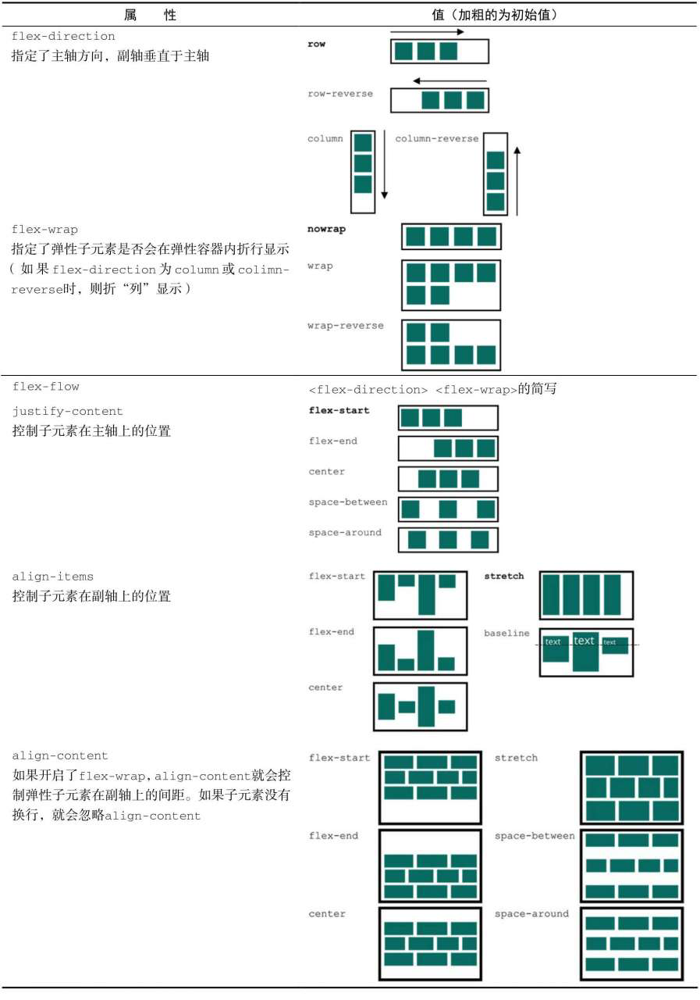
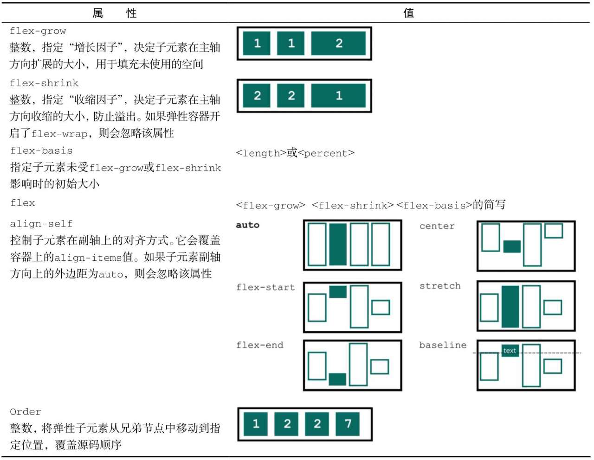

# CSS3 + Div + Bootstrap

## 选择器

### 基本选择器

|        选择器        |    类型    |
| :------------------: | :--------: |
|          *           | 通配选择器 |
|          E           | 元素选择器 |
|         #ID          |  ID选择器  |
|        .class        |  类选择器  |
| selector1, selectorN | 群组选择器 |

### 层次选择器

| 选择器 |      类型      |
| :----: | :------------: |
|  E F   |   后代选择器   |
|  E>F   |    子选择器    |
|  E+F   | 相邻兄弟选择器 |
|  E~F   | 通用兄弟选择器 |

### 伪类选择器

#### 动态伪类选择器

|  选择器   |   功能   |
| :-------: | :------: |
|  E:link   | 未被访问 |
| E:visited | 已被访问 |
|  E:hover  |   停留   |
| E:active  |  被激活  |
|  E:focus  | 获得焦点 |

> “爱恨原则” LoVe/HAte
> Link-visited-hover-active

#### 目标伪类选择器

|  选择器  |                  功能描述                   |
| :------: | :-----------------------------------------: |
| E:target | 选择匹配E的所有元素,且匹配元素被相关URL指向 |

#### 语言伪类选择器

:lang E(language)表示选择匹配E的所有元素，且匹配元素指定了lang属性，而且其值为language。

#### UI元素状态伪类选择器

|   选择器   |   类型   |
| :--------: | :------: |
| E:checked  | 选中状态 |
| E:enabled  | 启用状态 |
| E:disabled | 禁用状态 |

#### 结构伪类选择器

* E:first-child
* E:last-child
* E:root
* E F:nth-child(n)
* E F:nth-last-child(n)
* E:nth-of-type(n)
* E:nth-last-of-type(n)
* E:first-of-type
* E:last-of-type
* E:only-child
* E:empty

> n可以是整数,关键字(even,odd),公式(2n+1)等
> n的起始值为1,当n为0时将选择不到任何元素
> “:empty”用来选择没有任何内容的元素，这里“没有任何内容”指的是一点内容都没有，哪怕是一个空格。

#### 否定伪类选择器

|  选择器  |         功能描述         |
| :------: | :----------------------: |
| E:not(F) | 匹配所有除元素F外的E元素 |

### 伪元素选择器

> 双冒号与单冒号在CSS3中主要用来区分伪类和伪元素。

* ::first-letter
* ::first-line
* ::before
* ::after
* ::selection

### 属性选择器

|    选择器     |                   功能描述                   |
| :-----------: | :------------------------------------------: |
|    E[attr]    |         选择匹配具有属性attr的E元素          |
|  E[attr=val]  |        attr的属性值为val(区分大小写)         |
| E[attr\|=val] |    attr属性值是一个具有val或者以val-开始     |
| E[attr~=val]  | attr属性具有多个空格分隔的值,其中一个值为val |
| E[attr*=val]  |         attr属性中任意位置包含了val          |
| E[attr^=val]  |              attr属性以val开头               |
| E[attr$=val]  |              attr属性以val结尾               |

> E省略时表示任意类型元素

## 层叠, 优先级和继承

### 层叠

* 选择器和声明块一起组成了*规则集（ruleset）*
* `@规则(at-rules)`是指用“@”符号开头的语法。比如@import规则或者@media查询。
* 行内元素属于“带作用域的”声明，它会覆盖任何来自样式表或者`<style>`标签的样式。
* 伪类选择器（如：hover）和属性选择器（如[type="input"]）与一个类选择器的优先级相同。通用选择器（＊）和组合器（>、+、~）对优先级没有影响。
* 当给一些声明加上！important时，就会先比较来源，再使用常规的优先级规则。最终会让一切回到起点：一旦引入一个！important，就会带来更多的！important。
* 通常最好让优先级尽可能低，这样当需要覆盖一些样式时，才能有选择空间。
* 如果两个声明的来源和优先级相同，其中一个声明在样式表中出现较晚，或者位于页面较晚引入的样式表中，则该声明胜出。

### 继承

* 但不是所有的属性都能被继承。默认情况下，只有特定的一些属性能被继承，通常是我们希望被继承的那些。它们主要是跟文本相关的属性：color、font、font-family、font-size、font-weight、font-variant、font-style、line-height、letter-spacing、text-align、text-indent、text-transform、white-space以及word-spacing。
* 还有一些其他的属性也可以被继承，比如列表属性：list-style、list-style-type、list-style-position以及list-style-image。

### 特殊值

* 有两个特殊值可以赋给任意属性，用于控制层叠：`inherit`和`initial`。
* 有时，你需要撤销作用于某个元素的样式。这可以用initial关键字来实现。
* initial重置为属性的初始值，而不是元素的初始值。

### 简写属性

* 大多数简写属性可以省略一些值，只指定我们关注的值。但是要知道，这样做仍然会设置省略的值，即它们会被隐式地设置为初始值。这会默默覆盖在其他地方定义的样式。
* 尤其对于较小的元素，左右的内边距最好大于上下内边距。这种样式很适合网页的按钮或者导航链接

## 相对单位

### 相对值的好处

* CSS为网页带来了后期绑定（late-binding）的样式：直到内容和样式都完成了，二者才会结合起来。
* 响应式——在CSS中指的是样式能够根据浏览器窗口的大小有不同的“响应”。
* 1in = 25.4mm = 2.54cm = 6pc = 72pt = 96px
* CSS像素并不严格等于显示器的像素，尤其在高清屏（视网膜屏）下。

### em和rem

* 1em等于当前元素的字号，其准确值取决于作用的元素
* 浏览器会根据相对单位的值计算出绝对值，称作*计算值（computed value）*。
* 对大多数浏览器来说，默认的字号为16px。准确地说，medium关键字的值是16px。
* em用在内边距、外边距以及元素大小上很好，但是用在字号上就会很复杂。
* 在文档中，根节点是所有其他元素的祖先节点。根节点有一个`伪类选择器（:root）`，可以用来选中它自己。这等价于类型选择器html，但是html的优先级相当于一个类名，而不是一个标签。
* rem是root em的缩写。rem不是相对于当前元素，而是相对于根元素的单位
* 拿不准的时候，用rem设置字号，用px设置边框，用em设置其他大部分属性

### 视口的相对单位

* 视口——浏览器窗口里网页可见部分的边框区域。它不包括浏览器的地址栏、工具栏、状态栏。
* ❑ vh：视口高度的1/100。❑ vw：视口宽度的1/100。❑ vmin：视口宽、高中较小的一方的1/100（IE9中叫vm，而不是vmin）。❑ vmax：视口宽、高中较大的一方的1/100（本书写作时IE和Edge均不支持vmax）
* 相对视口单位有一个不起眼的用途，就是设置字号
* 这样做的好处在于元素能够在这两种大小之间平滑地过渡，这意味着不会在某个断点突然改变。当视口大小改变时，元素会逐渐过渡。
* calc()函数内可以对两个及其以上的值进行基本运算

### 无单位的数值和行高

* 任何长度单位（如px、em、rem）都可以用无单位的值0，因为这些情况下单位不影响计算值，即0px、0%、0em均相等。
* 一个无单位的0只能用于长度值和百分比，比如内边距、边框和宽度等，而不能用于角度值，比如度，或者时间相关的值，比如秒。
* 当一个元素的值定义为长度（px、em、rem，等等）时，子元素会继承它的计算值。
* 使用无单位的数值时，继承的是声明值，即在每个继承子元素上会重新算它的计算值。

### 自定义属性（即CSS变量）

* 变量名前面必须有两个连字符（--），用来跟CSS属性区分，剩下的部分可以随意命名
* 变量必须在一个声明块内声明。
* 调用函数`var()`就能使用该变量
* `var()`函数接受第二个参数，它指定了备用值。如果第一个参数指定的变量未定义，那么就会使用第二个值。
* 如果`var()`函数算出来的是一个非法值，对应的属性就会设置为其初始值。
* 自定义属性的声明能够层叠和继承：可以在多个选择器中定义相同的变量，这个变量在网页的不同地方有不同的值。
* 自定义属性就像作用域变量一样，因为它的值会被后代元素继承。

## 盒模型

### 元素宽度的问题

* 当给一个元素设置宽或高的时候，指定的是内容的宽或高，所有内边距、边框、外边距都是追加到该宽度上的。
* 魔术数值（magic number）
* 在CSS中可以使用box-sizing属性调整盒模型的行为。

```css
:root {
    box-sizing: border-box;
}

*,
::before,
::after {
    box-sizing: inherit;
}
```

* box-sizing的默认值为content-box，这意味任何指定的宽或高都只会设置内容盒子的大小。将box-sizing设置为border-box后，height和width属性会设置内容、内边距以及边框的大小总和
* 盒模型通常不会被继承，但是使用inherit关键字可以强制继承。

### 元素高度的问题

* 普通文档流是为限定的宽度和无限的高度设计的。
* 普通文档流——指的是网页元素的默认布局行为。行内元素跟随文字的方向从左到右排列，当到达容器边缘时会换行。块级元素会占据完整的一行，前后都有换行。
* 用overflow属性可以控制溢出内容的行为
* overflow值分别是visible、hidden、scroll、auto
* 可以用overflow-x属性单独控制水平方向的溢出，或者用overflow-y控制垂直方向溢出。
* 要想让百分比高度生效，必须给父元素明确定义一个高度。
* 给容器设置display: table，给每一列设置display:table-cell。
* 不像block的元素，默认情况下，显示为table的元素宽度不会扩展到100%，因此需要明确指定宽度
* 外边距并不会作用于table-cell元素
* 可以用表格元素的border-spacing属性来定义单元格的间距。该属性接受两个长度值：水平间距和垂直间距
* 正的外边距会将容器的边缘往里推，而负的外边距则会将边缘往外拉
* 给容器设置display: flex，它就变成了一个弹性容器（flex container），子元素默认等高。
* 除非别无选择，否则不要明确设置元素的高度。先寻找一个替代方案。设置高度一定会导致更复杂的情况。
* min-height和max-height。你可以用这两个属性指定最小或最大值，而不是明确定义高度，这样元素就可以在这些界限内自动决定高度。
* vertical-align声明只会影响行内元素或者table-cell元素。对于行内元素，它控制着该元素跟同一行内其他元素之间的对齐关系。
* CSS中最简单的垂直居中方法是给容器相等的上下内边距
* [howtocenterincss网站](http://howtocenterincss.com/)

### 负外边距

* 左边或顶部的负外边距将元素向左或者向上拉
* 右边或底部的负外边距将跟随其后的元素向左或向上拉(导致重叠)

### 容器内的元素间距

* 迟钝的猫头鹰选择器（lobotomized owl selector）（以下简称猫头鹰选择器），因为它长这样：`＊ + ＊`
* 它会选中页面上有着相同父级的非第一个子元素

## 浮动

### 浮动的设计初衷

* 浮动能将一个元素（通常是一张图片）拉到其容器的一侧，这样文档流就能够包围它。这种布局在报纸和杂志中很常见，因此CSS增加了浮动来实现这种效果
* *浮动元素会被移出正常文档流，并被拉到容器边缘*。文档流会重新排列，但是它会包围浮动元素此刻所占据的空间。如果让多个元素向同侧浮动，它们就会挨着排列
* 通过将内容放置到两个嵌套的容器中，然后给内层的容器设置外边距，让它在外层容器中居中 -> 双容器模式(double container pattern)
* 要实现将图片移动到网页一侧，并且让文字围绕图片的效果，浮动仍然是唯一的方法。

### 容器折叠和清除浮动

* 浮动元素不同于普通文档流的元素，它们的高度不会加到父元素上
* 将一个元素放在主容器的末尾，并对它使用clear，这会让容器扩展到浮动元素下面

### 出乎意料的“浮动陷阱”

* 浏览器会将浮动元素尽可能地放在靠上的地方

## Flexbox

* Flexbox，全称弹性盒子布局（Flexible Box Layout）

### Flexbox的原则

* 给元素添加display: flex，该元素变成了一个*弹性容器（flex container）*，它的*直接子元素*变成了*弹性子元素（flexitem）*。
* 弹性子元素默认是在同一行按照从左到右的顺序并排排列。弹性容器像块元素一样填满可用宽度，但是弹性子元素不一定填满其弹性容器的宽度。
* 弹性子元素高度相等，该高度由它们的内容决定。
* Flexbox允许使用`margin: auto`来填充弹性子元素之间的可用空间。

### 弹性子元素的大小

* flex属性控制弹性子元素在主轴方向上的大小
* flex属性是三个不同大小属性的简写：`flex-grow`、`flex-shrink`和`flex-basis`。
* flex-basis定义了元素大小的基准值，即一个初始的“主尺寸”。
* 多出来的留白（或剩余宽度）会按照flex-grow（增长因子）的值分配给每个弹性子元素，flex-grow的值为非负整数。
* flex-grow的值越大，元素的“权重”越高，也就会占据更大的剩余宽度。

### 对齐、间距等细节

弹性容器的属性:

弹性子元素的属性:


* justify-content控制子元素在主轴方向的对齐方式，align-items则控制子元素在副轴方向的对齐方式。align-items的初始值为stretch，在水平排列的情况下让所有子元素填充容器的高度，在垂直排列的情况下让子元素填充容器的宽度，因此它能实现等高列。
* 如果开启了换行（用flex-wrap）, align-content属性就可以控制弹性容器内沿副轴方向每行之间的间距。

## 网格布局

### 网页布局开启新纪元

* 跟Flexbox类似，网格布局也是作用于两级的DOM结构。
* 设置为`display: grid`的元素成为一个*网格容器（grid container）*。它的子元素则变成*网格元素（grid items）*。
* 分数单位（fraction unit） -> `fr`

### 网格剖析

* 网格的组成部分:
  * 网格线(grid line)
  * 网格轨道(grid track)
  * 网格单元(grid cell)
  * 网格区域(grid area)
* `repeat()`
* 如果想要一个网格元素在垂直方向上跨越1号网格线到3号网格线，就需要给元素设置`grid-column: 1 / 3`。或者设置`grid-row: 3 / 5`让元素在水平方向上跨越3号网格线到5号网格线。这两个属性一起就能指定一个元素应该放置的网格区域。
* Flexbox在一个方向上对齐元素，而网格在两个方向上对齐元素
* Flexbox以内容为切入点由内向外工作，而网格以布局为切入点由外向内工作

### 替代语法

* 网格布局共设计了三种语法：编号的网格线、命名的网格线、命名的网格区域。

### 显式和隐式网格

* `minmax()`函数。它指定两个值：最小尺寸和最大尺寸。浏览器会确保网格轨道的大小介于这两者之间。
* repeat()函数里的auto-fill关键字是一个特殊值。设置了之后，只要网格放得下，浏览器就会尽可能多地生成轨道，并且不会跟指定大小（minmax()值）的限制产生冲突。
* 加上紧凑的auto-flow选项dense，小网格元素会填满大的元素造成的空白区域。
* 子网格（subgrid）

### 特性查询

* @supports规则后面跟着一个小括号包围的声明。如果浏览器理解这个声明（在本例中，浏览器支持网格），它就会使用大括号里面的所有样式规则。如果它不理解小括号里的声明，就不会使用这些样式规则。

### 对齐

* CSS给网格布局提供了三个调整属性：justify-content、justify-items、justify-self
* 还有三个对齐属性：align-content、align-items、align-self
* 网格内的对齐属性
